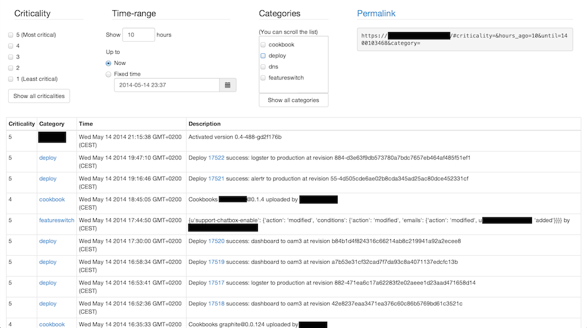

# changelog

Aims to answer the question "what's changed in the last hour?" in a distributed system. Very useful to have when the
proverbial bad things hit the proverbial ventilation hardware. It can drastically drop mean time to recovery.

## How?

`changelog` provides a simple REST API to post events to, and a web interface where you can quickly see and filter events.
The basic idea is that you'll send any event that has even a remote chance of causing problems to this system. Later,
when something goes wrong, you can quickly check what's changed in the last minutes / hours.

The web interface:


Sending events is simple:

```sh
curl http://changelog.awesomecompany.com/api/events \
  -X POST \
  -H 'Content-Type: application/json' \
  -d '{"criticality": 1, "unix_timestamp": 1395334488, "category": "misc", "description": "cli test"}'
```

All four JSON fields are required, and there are no other fields the server understands.

Clients implementing this logic (more to come):
 - bash: https://github.com/prezi/changelog-client-bash
 - python: https://github.com/woohgit/changelog-client-python
 - ruby: https://github.com/woohgit/changelog_client

Some ideas for events to send:
 - deployment, release
 - feature (switch|flag|toggle) changes
 - changes to chef / puppet / ansible / ...
 - changes to DNS configuration
 - cloud instances started, stopped


## Getting started

#### Prerequisites
 - a relational database
 - python 2
 - virtualenv
 - optionally: a [Sentry](https://getsentry.com/) server for collecting exceptions; not that there'll be any :)

#### Setup - Docker

A public image may be coming up. Until then:

```sh
sudo docker build -t changelog .
sudo docker run -d -p 80:8000 changelog
```

Watch out: with the current Dockerfile, upgrading the application in the container will erase the database. It may not
be a huge issue if you don't want to keep a long history, but keep it in mind.

#### Setup - Manually
```sh
git clone https://github.com/prezi/changelog.git
cd changelog
./setup.sh
. virtualenv/bin/activate
python application.py
```

#### Database support

Changelog uses SQLAlchemy to support a wide range of databases. The client library bindings are not included in
`requirements.txt` to make setup possible in the absence of client libraries on the system. If you want to use
a database other than SQLite (you should), then you'll need to manually install the python bindings. Additional
requirements files are provided to install known good versions of the bindings:

 - MySQL: `pip install -r requirements-mysql.txt`
 - PostgreSQL: `pip install -r requirements-postgresql.txt`

## Configuration

You can set the environment variable `CHANGELOG_SETTINGS_PATH` to point to a python file. That file can set the values detailed
below. The application prints the final configuration at startup to make debugging this easier (not that there's anything
to debug, but configuration always needs debugging). The file pointed to by `CHANGELOG_SETTINGS_PATH` can, for example,
look like this:

```python
LISTEN_PORT = 8080
DB_PATH = '/opt/foo/bar/local/changelog.db'
```

Values you can set:

| Variable      | Description                                                                      | Default        |
|---------------|----------------------------------------------------------------------------------|----------------|
| `ALCHEMY_URL`     | SQL Alchemy connection string.                                               |`sqlite:///changelog.db`  |
| `LISTEN_HOST` | IP address where the application will listen when started with `python application.py`.| `127.0.0.1`         |
| `LISTEN_PORT` | Port where the application will listen when started with `python application.py`.| `5000`         |
| `USE_SENTRY`  | Send exceptions to Sentry?                                                       | `False`        |
| `SENTRY_DSN`  | Sentry DSN, used only if `USE_SENTRY` is `True`.                                 | `None`         |

The default configuration values are in [settings.py](settings.py).

## Considerations for running in production

 - Running under a WSGI server is highly recommended. This project uses the Flask framework, see their documentation for
   running under [Apache](http://flask.pocoo.org/docs/deploying/mod_wsgi/) or [Standalone WSGI containers](http://flask.pocoo.org/docs/deploying/wsgi-standalone/)
 - No authentication is provided, you'll probably want to put some authenticating proxy in front of this application.
   Pull requests for adding authentication support are of course welcome.
 - Similarly, no HTTPS termination is provided. Ideally the WSGI container will take care of that.

## Contributing

Feature requests are welcome, bug reports are especially welcome, and pull requests are super welcome. Please make sure
to use a feature branch in your fork. Don't look too hard for tests, there are none - not for a lack of belief in tests,
but because the application is almost trivial. Please make sure you also update the README to reflect your changes. While you're there you may as well add yourself to the Credits section too :)

## Credits

 - Roy Rapoport (@royrapoport) for inspiring this tool with his talk at the
   [SF Metrics Meetup](http://blog.librato.com/posts/2013/6/12/sf-metrics-meetup-change-reporting-and-building-metrics-from-log-data)
 - Zoltan Nagy (@abesto): initial implementation, current maintainer
 - Ryan Bowlby (@rbowlby)
 - Bálint Csergő (@deathowl) for adding SQLAlchemy support

## Awesome tools used
These tools made it possible to write `changelog` in a weekend. Huge thanks.

- [Flask](http://flask.pocoo.org/), the lightweight Python web framework and
  [Flask-RESTful](http://flask-restful.readthedocs.org/en/latest/) for making the REST api trivial to write
- [Bootstrap](http://getbootstrap.com/), for making the whole UI look not terrible
  and [bootstrap-datetimepicker](http://bootstrap-datepicker.readthedocs.org/en/release/) for making the date chooser
  pretty awesome
- [jQuery](http://jquery.com/), because obviously
- [jQuery BBQ](http://benalman.com/code/projects/jquery-bbq/docs/files/jquery-ba-bbq-js.html) and
  [jQuery hashchange](http://benalman.com/code/projects/jquery-hashchange/docs/files/jquery-ba-hashchange-js.html)
  for making the permalink simple to implement
- [Sentry](http://getsentry.com/) for simple-to-use, awesome error reporting / collection / aggregation
- [cdnjs](http://cdnjs.com/) for hosting all the client-side libraries above
- [SQLAlchemy](http://www.sqlalchemy.org/) 
- [Flask-SQLAlchemy](https://github.com/mitsuhiko/flask-sqlalchemy) SQLAlchemy support for Flask
- Those that we take for granted: sqlite3, python, virtualenv, and the list goes on...

<hr>


<sup>Image gleefully copied from [Android Police](http://www.androidpolice.com/2011/03/07/cyanogenmod-7-rc2-rolling-out-now-packing-android-2-3-3-new-features-bugfixes/)</sup>

